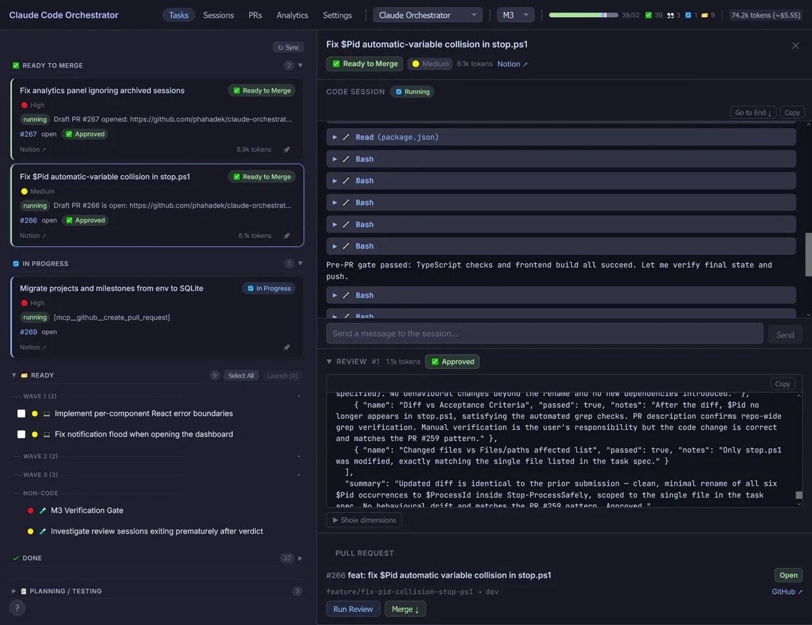
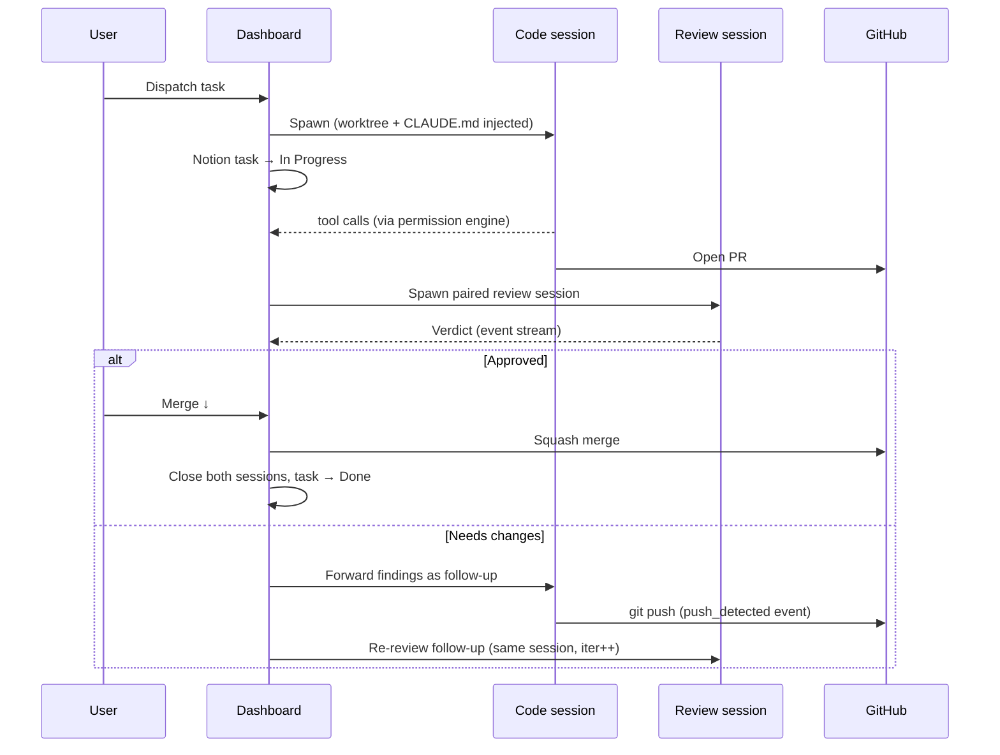
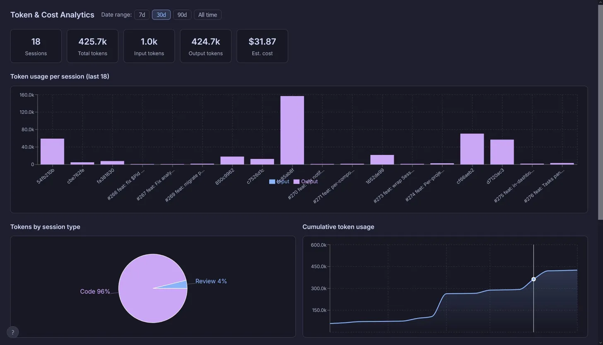

# Claude Code Orchestrator

A local web dashboard for browsing, managing, and orchestrating [Claude Code](https://docs.anthropic.com/en/docs/claude-code) sessions. Built for solo developers who want visibility and control over automated coding workflows — and bootstrapped by being used to build itself.



## What it does

- Browse, search, and filter Claude Code session history with full message timelines
- Switch between multiple repos, each with its own task board and session lifecycle
- Watch sessions in real time with live token usage and per-model cost estimates
- Dispatch coding tasks from Notion (or local YAML), with automated PR review and lifecycle management
- Monitor pull requests — verdicts, merge state, conflict detection — without leaving the dashboard

## Design highlights

- **Four-tier permission engine** — every tool call passes through hard-deny patterns, hard-allow patterns, user rules stored in SQLite, and finally escalation to the UI. Stateless, ~140 lines, glob or regex match per rule.
- **Persistent review sessions** — each PR gets one review session that stays alive for the PR's lifetime. Re-reviews are follow-up messages on the same session, not respawns, so the reviewer accumulates context across iterations.
- **Backend owns the lifecycle** — task status (`In Progress` → `In Review` → `Done`), session start/stop, and PR-to-task linkage are managed server-side. Sessions are explicitly told not to update Notion themselves; the orchestrator does it.
- **Event-driven review-merge loop** — push detection from `git push` tool calls, verdict parsed from the review session's event stream. No GitHub API polling except a single 5-minute fallback for PRs merged directly on GitHub.
- **Per-model token and cost tracking** — Opus, Sonnet, and Haiku pricing baked in (input + output per-million rates). Live cost estimates per session and aggregated per project.
- **Bootstrapped** — built using itself across ~500 commits and three shipped milestones (read-only session browser → multi-project orchestration → automated review and lifecycle), then used to ship three other projects.

## Quick taste

A real excerpt from `packages/backend/src/permissions/PermissionEngine.ts`:

```ts
const HARD_DENY = [
  'Bash *rm -rf*',
  'Bash *git push --force*main*',
  'Bash *chmod -R 777*',
];
const HARD_ALLOW = [
  'Read *',
  'Bash *git status*',
  'Bash *npx tsc*',
  'Bash *npm run *',
];
// 1. hard-deny → 2. hard-allow → 3. user rules from SQLite → 4. escalate to UI
```

User rules live in the `permission_rules` SQLite table, ordered by `order_index`, glob or regex, allow or deny. The first match wins.

## How it works

When you click **Dispatch**, the backend spawns one Claude CLI subprocess per selected task — each in its own git worktree under `.claude/worktrees/<sessionId>` — and streams the JSONL event output back over WebSocket. The Notion task is moved to `In Progress` server-side. Every tool call the session attempts is intercepted by the permission engine; matched calls run, unmatched calls suspend the session and surface in the attention queue. When the session opens a PR, a paired persistent review session is spawned, parses a verdict from its own event stream, and either approves the PR or sends findings back to the originating session as a follow-up message — and the loop continues until the PR is merged.



| Layer             | Tech                                          | Path                                            |
| ----------------- | --------------------------------------------- | ----------------------------------------------- |
| Frontend          | React 19 + Vite (TypeScript)                  | `packages/frontend/`                            |
| Backend           | Node.js + Express (TypeScript)                | `packages/backend/`                             |
| Transport         | WebSocket (`ws`)                              | real-time session events                        |
| Database          | SQLite (`better-sqlite3`)                     | session metadata, PR tracking, permission rules |
| Task source       | Notion REST API, GitHub Issues, or local YAML | configured per project                          |
| Session execution | `claude` CLI subprocess                       | one process per session, JSONL on stdout        |

## Quickstart

**Prerequisites**

- Node.js 20 LTS and npm
- [`claude`](https://docs.anthropic.com/en/docs/claude-code) CLI installed and authenticated (`claude login`)
- Notion integration token (if using Notion as a task source)
- GitHub PAT with `repo` scope (for PR tracking)

**Happy path**

```bash
git clone https://github.com/phahadek/claude-orchestrator.git && cd claude-orchestrator
npm install
git config blame.ignoreRevsFile .git-blame-ignore-revs      # once per clone — hides mass-format commits from blame
cp packages/backend/.env.example packages/backend/.env       # then edit
cp .claude/local-context.md.example .claude/local-context.md # gitignored — add your Notion URLs
npm run dev    # → http://localhost:5173 (dev; Vite proxies API/WS to backend on :3000)
```

`.claude/local-context.md` is gitignored and holds host-local references (Notion URLs, board IDs). Sessions read it as their first action. See [`docs/install.md`](docs/install.md) for details and an optional pre-commit hook that blocks workspace-ID leaks.

For Docker, production builds, the full env var reference, and Notion/local task source setup, see [`docs/install.md`](docs/install.md).

### Configure your first project

Projects and milestones are managed entirely from the dashboard UI — there is no `PROJECTS` env var to populate, and no restart is required after adding or editing them. Configuration is persisted to the dashboard's SQLite database.

1. Open the dashboard, then go to **Settings → Projects → Add project**.
2. Fill in the project name, the absolute path to its local repo (`projectDir`), the GitHub `owner/repo`, and choose a **Task source**:
   - **Notion** — the Settings form labels Context URL as optional, but Notion projects in practice need it: paste the URL of the Project Context page. See [`docs/notion-template.md`](docs/notion-template.md) for the workspace structure the dashboard expects.
   - **GitHub** — tasks are GitHub Issues labeled and organized by milestone. See [`docs/github-template.md`](docs/github-template.md) for label vocabulary, issue body structure, and repo bootstrap steps.
   - **Jira** — tasks are Jira issues organized under an Epic (the milestone). See [`docs/jira-template.md`](docs/jira-template.md) for issue type mapping, workflow status conventions, and project bootstrap steps.
   - **YAML** — tasks live in `<projectDir>/tasks.yaml` (gitignored by default). See [`docs/yaml-template.md`](docs/yaml-template.md) for the schema reference and conventions.
3. Open **Settings → Milestones → Add milestone** and add as many milestones as you need. For Notion projects, paste the **database ID** of each milestone's task board (a 32-character hex string — pages and databases both have IDs, and they are not interchangeable; copy from the database URL, not a parent page).
4. The Tasks panel shows the active milestone's tasks. The default active milestone is the first one in display order; if a project has more than one milestone, a milestone selector appears in the header next to the project switcher, and your choice is remembered per browser via `localStorage`. Click **Dispatch** on any `🗂️ Ready` task to spawn a Claude session in a worktree.



The Analytics tab tracks per-session token usage and per-model cost across the project's history.

## Documentation

- [Product Design](docs/design.md) — user goals, workflows, UI layout, and resolved design decisions
- [Technical Architecture](docs/architecture.md) — stack, project structure, key systems, data flow, SQLite schema
- [Coding Guidelines](docs/coding-guidelines.md) — architectural rules, naming, patterns, git etiquette
- [Task Writing Guidelines](docs/task-writing.md) — how to scope and write Notion tasks for this orchestrator
- [Install guide](docs/install.md) — production setup and full env var reference
- [Notion template](docs/notion-template.md) — set up a Notion workspace compatible with this orchestrator
- [GitHub template](docs/github-template.md) — label vocabulary, issue body structure, and repo bootstrap for GitHub-backed projects
- [Jira template](docs/jira-template.md) — issue type mapping, workflow statuses, Epic milestone semantics, and project bootstrap for Jira-backed projects
- [YAML template](docs/yaml-template.md) — schema reference and conventions for YAML-backed projects
- [Orchestrator project setup](docs/orchestrator-project-setup.md) — point the orchestrator at an external project (C#, Rust, Godot, …) via `.claude/orchestrator.json` and a bootstrap script

## License

[MIT](LICENSE)
