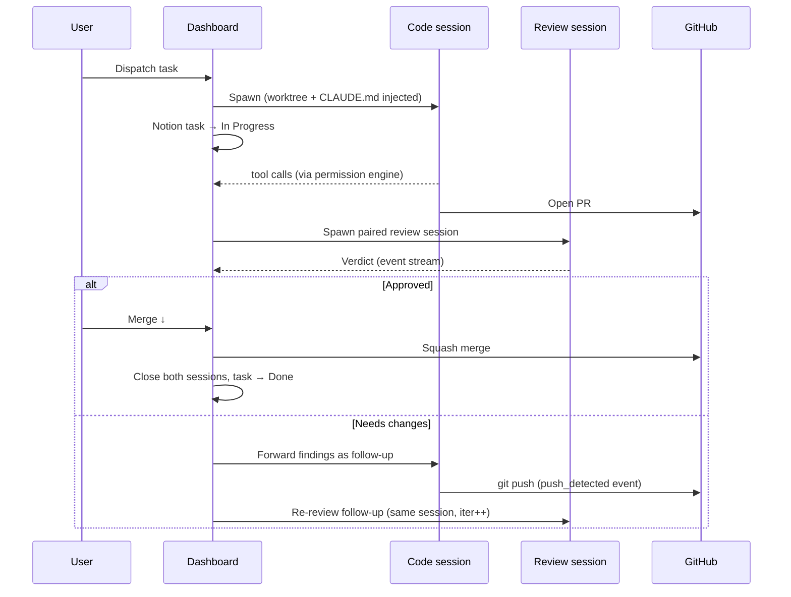

# Claude Code Dashboard

A local web dashboard for browsing, managing, and orchestrating [Claude Code](https://docs.anthropic.com/en/docs/claude-code) sessions. Built for solo developers who want visibility and control over automated coding workflows — and bootstrapped by being used to build itself.

## What it does

- Browse, search, and filter Claude Code session history with full message timelines
- Switch between multiple repos, each with its own task board and session lifecycle
- Watch sessions in real time with live token usage and per-model cost estimates
- Dispatch coding tasks from Notion (or local YAML), with automated PR review and lifecycle management
- Monitor pull requests — verdicts, merge state, conflict detection — without leaving the dashboard

## Design highlights

- **Four-tier permission engine** — every tool call passes through hard-deny patterns, hard-allow patterns, user rules stored in SQLite, and finally escalation to the UI. Stateless, ~140 lines, glob or regex match per rule.
- **Persistent review sessions** — each PR gets one review session that stays alive for the PR's lifetime. Re-reviews are follow-up messages on the same session, not respawns, so the reviewer accumulates context across iterations.
- **Backend owns the lifecycle** — task status (`In Progress` → `In Review` → `Done`), session start/stop, and PR-to-task linkage are managed server-side. Sessions are explicitly told not to update Notion themselves; the orchestrator does it.
- **Event-driven review-merge loop** — push detection from `git push` tool calls, verdict parsed from the review session's event stream. No GitHub API polling except a single 5-minute fallback for PRs merged directly on GitHub.
- **Per-model token and cost tracking** — Opus, Sonnet, and Haiku pricing baked in (input + output per-million rates). Live cost estimates per session and aggregated per project.
- **Bootstrapped** — built using itself across ~500 commits and three shipped milestones (read-only session browser → multi-project orchestration → automated review and lifecycle), then used to ship three other projects.

## Quick taste

A real excerpt from `packages/backend/src/permissions/PermissionEngine.ts`:

```ts
const HARD_DENY = [
  'Bash *rm -rf*',
  'Bash *git push --force*main*',
  'Bash *chmod -R 777*',
];
const HARD_ALLOW = [
  'Read *',
  'Bash *git status*',
  'Bash *npx tsc*',
  'Bash *npm run *',
];
// 1. hard-deny → 2. hard-allow → 3. user rules from SQLite → 4. escalate to UI
```

User rules live in the `permission_rules` SQLite table, ordered by `order_index`, glob or regex, allow or deny. The first match wins.

## How it works

When you click **Dispatch**, the backend spawns one Claude CLI subprocess per selected task — each in its own git worktree under `.claude/worktrees/<sessionId>` — and streams the JSONL event output back over WebSocket. The Notion task is moved to `In Progress` server-side. Every tool call the session attempts is intercepted by the permission engine; matched calls run, unmatched calls suspend the session and surface in the attention queue. When the session opens a PR, a paired persistent review session is spawned, parses a verdict from its own event stream, and either approves the PR or sends findings back to the originating session as a follow-up message — and the loop continues until the PR is merged.



| Layer | Tech | Path |
|---|---|---|
| Frontend | React 19 + Vite (TypeScript) | `packages/frontend/` |
| Backend | Node.js + Express (TypeScript) | `packages/backend/` |
| Transport | WebSocket (`ws`) | real-time session events |
| Database | SQLite (`better-sqlite3`) | session metadata, PR tracking, permission rules |
| Task source | Notion REST API or local YAML | configurable per project |
| Session execution | `claude` CLI subprocess | one process per session, JSONL on stdout |

## Quickstart

**Prerequisites**

- Node.js 20 LTS and npm
- [`claude`](https://docs.anthropic.com/en/docs/claude-code) CLI installed and authenticated (`claude login`)
- Notion integration token (if using Notion as a task source)
- GitHub PAT with `repo` scope (for PR tracking)

**Happy path**

```bash
git clone https://github.com/phahadek/claude-orchestrator.git && cd claude-orchestrator
npm install
cp packages/backend/.env.example packages/backend/.env  # then edit
npm run dev    # → http://localhost:3000
```

For Docker, production builds, the full env var reference, and Notion/local task source setup, see [`docs/install.md`](docs/install.md).

## Documentation

- [Product Design](docs/design.md) — user goals, workflows, UI layout, and resolved design decisions
- [Technical Architecture](docs/architecture.md) — stack, project structure, key systems, data flow, SQLite schema
- [Coding Guidelines](docs/coding-guidelines.md) — architectural rules, naming, patterns, git etiquette
- [Task Writing Guidelines](docs/task-writing.md) — how to scope and write Notion tasks for this orchestrator
- [Install guide](docs/install.md) — production setup and full env var reference
- [Notion template](docs/notion-template.md) — set up a Notion workspace compatible with this orchestrator

## License

[MIT](LICENSE)
