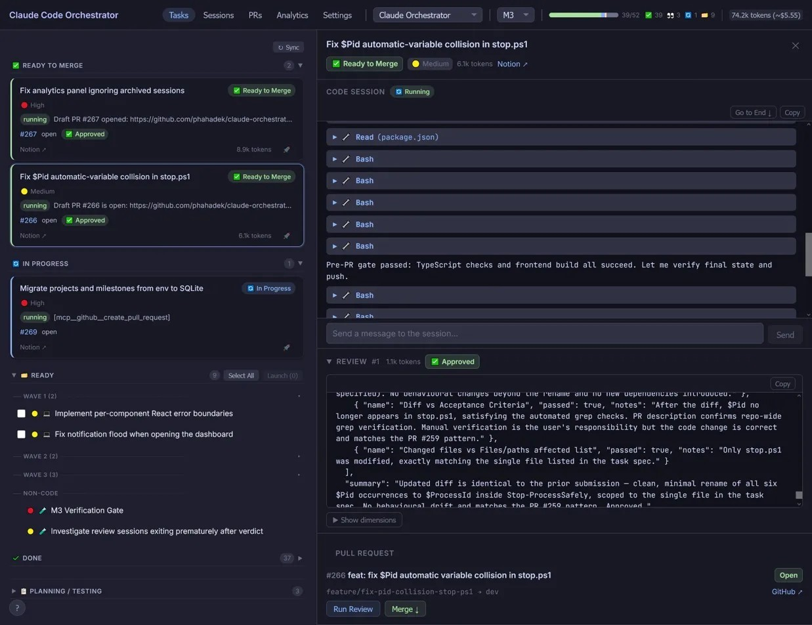
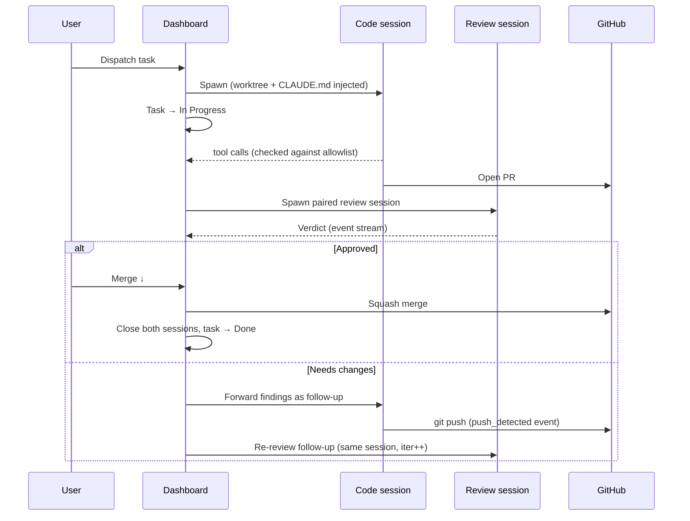
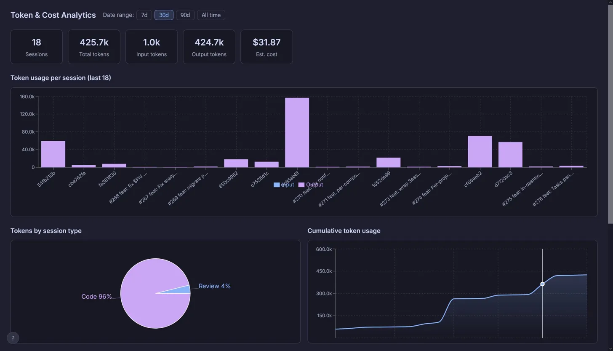

# Claude Code Orchestrator

A local web dashboard for browsing, managing, and orchestrating [Claude Code](https://docs.anthropic.com/en/docs/claude-code) sessions. Built for solo developers who want visibility and control over automated coding workflows — and bootstrapped by being used to build itself.



## What it does

- Browse, search, and filter Claude Code session history with full message timelines
- Switch between multiple repos, each with its own task board and session lifecycle
- Watch sessions in real time with live token usage and per-model cost estimates
- Dispatch coding tasks from Notion, GitHub Issues, Jira, or local YAML, with automated PR review and lifecycle management
- Monitor pull requests — verdicts, merge state, conflict detection — without leaving the dashboard
- Run dispatched planning sessions (grooming, design, ops, docs) that propose task and architecture changes as staged intents for a human to approve, rather than writing directly

## Design highlights

- **Deny-by-default tool permissions** — every tool call is checked against a spawn-time `--allowed-tools` allowlist assembled per session (a base set plus per-project `.claude-orchestrator.yml` overrides). A call that isn't on the list is denied and logged, not escalated to a UI prompt — there is no runtime permission-rule store or approval queue.
- **Persistent review sessions** — each PR gets one review session that stays alive for the PR's lifetime. Re-reviews are follow-up messages on the same session, not respawns, so the reviewer accumulates context across iterations.
- **Backend owns the lifecycle; sessions write through staged intents** — task status (`In Progress` → `In Review` → `Done`), session start/stop, and PR-to-task linkage are managed server-side. A dispatched planning session originates task and architecture writes as staged intents through the orchestrator's own MCP tool surface; a human (or, for a narrow set of kinds, another session) dispositions each one before it's applied.
- **Event-driven review-merge loop** — push detection from `git push` tool calls, verdict parsed from the review session's event stream. No GitHub API polling except a single 5-minute fallback for PRs merged directly on GitHub.
- **Per-model token and cost tracking** — Opus, Sonnet, and Haiku pricing baked in (input + output per-million rates). Live cost estimates per session and aggregated per project.
- **Milestone convergence and the Manual Verification Gate** — a per-milestone readiness rollup combines gate, config-seed, and ops signals into one "converged" view; the gate itself tracks each milestone-end verification item through its own runnable/disposition lifecycle, run interactively via the `/gate` skill.
- **Bootstrapped** — built using itself across 1,700+ commits and thirteen shipped milestones (read-only session browser → multi-project orchestration → automated review and lifecycle → enterprise adoption and GitHub/Jira task sources → architectural debt paydown → orchestrator-owned planning and the staged-intent decision surface → milestone convergence and auto-dispatch), then used to ship three other projects.

## Quick taste

The permission model, real excerpts from `packages/backend/src/config.ts` and `ApiSessionRunner.ts`:

```ts
// A base allowlist, extended per project by .claude-orchestrator.yml:
export const ALLOWED_TOOLS = [
  'Bash(git:*)', 'Bash(npm:*)', 'Bash(npx:*)', 'Bash(node:*)', 'Bash(tsc:*)',
  'Bash(find:*)', 'Bash(grep:*)', /* … */
];

// canUseTool only fires for calls NOT already covered by allowedTools — deny them.
canUseTool: async (toolName, input) => ({
  behavior: 'deny',
  message: `Tool '${toolName}' is not in the allowed tools list`,
});
```

There is no user-editable rule store and no escalate-to-UI tier: a call is either pre-approved by the spawn-time allowlist, or it's denied and logged to `permission_denials`.

## How it works

When you click **Dispatch**, the backend spawns one Claude session per selected task — CLI subprocess, Agent SDK (API mode), or a sandboxed Docker container, three interchangeable `ISessionRunner` implementations (`CliSessionRunner`, `ApiSessionRunner`, `DockerSessionRunner`) — each in its own git worktree under `.claude/worktrees/<sessionId>`, and streams the event output back over WebSocket. The task is moved to `In Progress` server-side. Every tool call the session attempts is checked against its spawn-time allowlist; unmatched calls are denied and logged, not escalated. When the session opens a PR, a paired persistent review session is spawned, parses a verdict from its own event stream, and either approves the PR or sends findings back to the originating session as a follow-up message — and the loop continues until the PR is merged.


```mermaid
sequenceDiagram
    participant U as User
    participant D as Dashboard
    participant C as Code session
    participant R as Review session
    participant G as GitHub

    U->>D: Dispatch task
    D->>C: Spawn (worktree + CLAUDE.md injected)
    D->>D: Task → In Progress
    C-->>D: tool calls (checked against allowlist)
    C->>G: Open PR
    D->>R: Spawn paired review session
    R-->>D: Verdict (event stream)
    alt Approved
        U->>D: Merge ↓
        D->>G: Squash merge
        D->>D: Close both sessions, task → Done
    else Needs changes
        D->>C: Forward findings as follow-up
        C->>G: git push (push_detected event)
        D->>R: Re-review follow-up (same session, iter++)
    end
```

| Layer              | Tech                                          | Path                                                            |
| ------------------- | --------------------------------------------- | ----------------------------------------------------------------- |
| Frontend            | React 19 + Vite (TypeScript)                  | `packages/frontend/`                                               |
| Backend             | Node.js + Express (TypeScript)                | `packages/backend/`                                                |
| Transport           | WebSocket (`ws`)                              | real-time session events                                           |
| Database            | SQLite (`better-sqlite3`)                     | session metadata, PR tracking, staged intents, gate/seed items     |
| Task source         | Notion REST API, GitHub Issues, Jira, or local YAML | configured per project                                       |
| Session execution   | `claude` CLI subprocess, Agent SDK, or Docker  | one of three `ISessionRunner` implementations per session          |
| Orchestrator MCP    | in-process MCP server                          | `packages/backend/src/mcp/` — the tool surface (`task.create`, `gate.verify`, `journal.setState`, …) dispatched sessions use to stage writes |

## Planning, dispatch & the decision surface

Beyond spawning coding sessions, the orchestrator runs its own planning work as **dispatched sessions** — `groom` (backlog grooming), `design` (design execution), `ops` (operational/investigation tasks), and `docs` (documentation authoring) each run as their own session type against a project's task board, either launched by a human or, where a milestone has auto-dispatch armed, launched automatically.

- **Staged-intent decision surface** — a dispatched session never writes a task or architecture change directly. It calls an orchestrator MCP tool (`task.setStatus`, `arch.createUnit`, `gate.accrete`, …), which stages a `staged_intent` row instead of applying it. A human (or, for select kinds, another session) approves, rejects, or group-commits the intent before it takes effect.
- **Per-flow auto-dispatch arm toggles** — each milestone independently arms or disarms each flow (`groom`, `design`, `ops`, `gate-verify`, …) via a `flow_arm` row; an armed flow's dispatch trigger evaluator picks up eligible work unattended, a disarmed one waits for a human to launch it.
- **The architecture unit store** — an orchestrator-owned record of architecture decisions (`ArchUnitStore`), each unit a titled statement with a kind/topic/region envelope, a markdown body, and an append-only event log. Like task writes, units are only ever changed through the staged-apply command path, never a raw session write.
- **Milestone convergence and the Manual Verification Gate** — the convergence view rolls up gate, config-seed, and ops readiness into one per-milestone signal; the gate itself is a `gate_item` store of milestone-end verification items, each carrying its own classification (Read-Only, Prod-Mutating, Opportunistic, Human-Observation) and disposition history, verified via the `/gate` skill.

## Quickstart

**Prerequisites**

- Node.js 20 LTS and npm
- [`claude`](https://docs.anthropic.com/en/docs/claude-code) CLI installed and authenticated (`claude login`)
- Notion integration token (if using Notion as a task source)
- GitHub PAT with `repo` scope (for PR tracking)
- [`gitleaks`](https://github.com/gitleaks/gitleaks) ≥ 8.x (macOS: `brew install gitleaks` · Windows: `choco install gitleaks`) — used by the `analyze:` gate for secret scanning

**Happy path**

```bash
git clone https://github.com/phahadek/claude-orchestrator.git && cd claude-orchestrator
npm install
git config blame.ignoreRevsFile .git-blame-ignore-revs      # once per clone — hides mass-format commits from blame
cp packages/backend/.env.example packages/backend/.env       # then edit
npm run dev    # → http://localhost:5173 (dev; Vite proxies API/WS to backend on :3000)
```

See [`docs/install.md`](docs/install.md) for Docker, production builds, the full env var reference, and Notion/GitHub/Jira/YAML task-source setup.

### Configure your first project

Projects and milestones are managed entirely from the dashboard UI — there is no `PROJECTS` env var to populate, and no restart is required after adding or editing them. Configuration is persisted to the dashboard's SQLite database.

1. Open the dashboard, then go to **Settings → Projects → Add project**.
2. Fill in the project name, the absolute path to its local repo (`projectDir`), the GitHub `owner/repo`, and choose a **Task source**:
   - **Notion** — the Settings form labels Context URL as optional, but Notion projects in practice need it: paste the URL of the Project Context page. See [`docs/notion-template.md`](docs/notion-template.md) for the workspace structure the dashboard expects.
   - **GitHub** — tasks are GitHub Issues labeled and organized by milestone. See [`docs/github-template.md`](docs/github-template.md) for label vocabulary, issue body structure, and repo bootstrap steps.
   - **Jira** — tasks are Jira issues organized under an Epic (the milestone). See [`docs/jira-template.md`](docs/jira-template.md) for issue type mapping, workflow status conventions, and project bootstrap steps.
   - **YAML** — tasks live in `<projectDir>/tasks.yaml` (gitignored by default). See [`docs/yaml-template.md`](docs/yaml-template.md) for the schema reference and conventions.
3. Open **Settings → Milestones → Add milestone** and add as many milestones as you need. For Notion projects, paste the **database ID** of each milestone's task board (a 32-character hex string — pages and databases both have IDs, and they are not interchangeable; copy from the database URL, not a parent page).
4. The Tasks panel shows the active milestone's tasks. The default active milestone is the first one in display order; if a project has more than one milestone, a milestone selector appears in the header next to the project switcher, and your choice is remembered per browser via `localStorage`. Click **Dispatch** on any `🗂️ Ready` task to spawn a Claude session in a worktree.



*(Screenshots above predate the gate, architecture, and milestone views — kept for now rather than fabricated.)*

The Analytics tab tracks per-session token usage and per-model cost across the project's history.

## Deployment

Development runs with `npm run dev`. For production:

- **`npm start`** runs the compiled backend (`node packages/backend/dist/server.js`), which serves the built frontend from the same process and port — no separate dev server.
- **A structured deploy playbook** — `<projectDir>/.claude-deploy-playbook.yml` — drives the `/deploy` skill's confirm-gated, step-by-step production rollout (preconditions, ordered steps, verification, rollback, hazards). This repo ships its own playbook at the repo root for its self-hosted deployment.
- **`installers/linux/`** ships a systemd unit (`orchestrator.service`) plus `.deb`/`.AppImage` build scripts for running from source on a dedicated host; `installers/macos/` and `installers/windows/` build a `.dmg` and an Inno Setup installer respectively, each bundling Node 20 LTS.
- **The auto-updater** polls the GitHub Releases API and surfaces a new version to users within 24 hours of a release being cut; see [`RELEASE.md`](RELEASE.md) for the `dev` → `main` release process it depends on.

## Documentation

- [Product Design](docs/design.md) — user goals, workflows, UI layout, and resolved design decisions
- [Technical Architecture](docs/architecture.md) — stack, project structure, key systems, data flow, SQLite schema
- [Coding Guidelines](docs/coding-guidelines.md) — architectural rules, naming, patterns, git etiquette
- [ESLint Conventions](docs/eslint-conventions.md) — when to fix vs. disable a lint rule
- [Task Writing Guidelines](docs/task-writing.md) — how to scope and write Notion tasks for this orchestrator
- [Install guide](docs/install.md) — production setup and full env var reference
- [`.claude-orchestrator.yml` reference](docs/orchestrator-config.md) — per-project session config: pre-PR gate commands, the `analyze:` gate, allowed-tools extensions, bash rules
- [Docker mode — operator setup](docs/docker-mode/operator-setup.md) — sandboxed per-session containers with a restricted egress proxy, for corporate mode
- [Notion template](docs/notion-template.md) — set up a Notion workspace compatible with this orchestrator
- [GitHub template](docs/github-template.md) — label vocabulary, issue body structure, and repo bootstrap for GitHub-backed projects
- [Jira template](docs/jira-template.md) — issue type mapping, workflow statuses, Epic milestone semantics, and project bootstrap for Jira-backed projects
- [Jira Task Writing Guidelines](docs/jira-task-writing.md) — how to scope and write Jira issues as orchestrator tasks
- [YAML template](docs/yaml-template.md) — schema reference and conventions for YAML-backed projects
- [Orchestrator project setup](docs/orchestrator-project-setup.md) — point the orchestrator at an external project (C#, Rust, Godot, …) via `.claude/orchestrator.json` and a bootstrap script
- [`RELEASE.md`](RELEASE.md) — the `dev` → `main` release process and the auto-updater's version contract
- [`CHANGELOG.md`](CHANGELOG.md) — notable changes per release
- [`installers/`](installers/) — per-OS build guides (Linux `.deb`/`.AppImage` + systemd unit, macOS `.dmg`, Windows Inno Setup)

## Grooming & design skills

The `/groom` (Backlog Grooming) and `/design` (Design Execution) Claude Code skills are
source-controlled here and re-vendored to `~/.claude` via the run-by-hand `/sync-guidelines`
skill (a reconcile, never a file-copy deploy):

- **Vendored artifacts:** `scripts/{design-load,check-task-status,sync-guidelines-load,
notion-page,ops-client}.mjs`, `packages/backend/scripts/{groom-context-client,
gate-state-client,seed-state-client,staged-intents-client}.mjs`,
  `skills/{groom,design,ops,deploy,wrap,sync-guidelines}/**`, and `config-template/**` (the
  Remote Control bootstrap — see below). `groom-load.mjs`, `ops-load.mjs`,
  `ops-journal-set.mjs`, `stage-task-intent.mjs`, and the `groom-gate.mjs` PreToolUse hook
  are retired — groom/ops context reads go through the device-authed route clients above,
  dispatched-session task-write staging and verdict delivery go through the orchestrator
  MCP tool surface, and the promotion gate is enforced server-side (`groomGate.ts`) on
  staged-intent apply.
- **Deploy — one mechanism, always a reconcile.** Re-vendoring anything this repo deploys — the
  scripts into `~/.claude/scripts/`, the skill trees into `~/.claude/skills/`, the hook into the
  central config tree, and the guideline docs — goes through the **`/sync-guidelines` skill**
  (`node ~/.claude/scripts/sync-guidelines-load.mjs` for the deterministic plan step). There is no
  force-overwrite deploy script: a previous one, `scripts/deploy-grooming.mjs`, blind-copied with
  `cpSync(..., { force: true })` and silently destroyed vendored-local content; it has been
  removed. `/sync-guidelines` diffs the upstream delta since the recorded per-item baseline and
  weaves it into the live copy — preserving any local content (a refined skill instruction, an
  emergency script hotfix, the guideline docs' filled Project index) — confirm-gated before it
  writes anything.
- **Manifest:** each managed repo's grooming manifest lives in the **central config tree** at
  `config/projects/<repo-dir>/grooming.json` (outside the repo), not in `.claude/`. The loaders
  resolve it by repo basename via `$ORCHESTRATOR_CONFIG_DIR` / `--config-dir` / a host-aware
  default (a `config/` dir beside the projects root: dev `<repo>/../config`, prod
  `<repo>/../../config`). See `skills/groom/reference/manifest.example.json`.
- **One-time hook registration (manual):** a `PreToolUse` gate runs on the task-source MCP
  tools — `check-task-status.mjs` (blocks creating a task at any status other than
  `🔲 Backlog`). `/sync-guidelines` does **not** edit user-global settings, so register it once
  in `~/.claude/settings.json`:

  ```json
  {
    "hooks": {
      "PreToolUse": [
        {
          "matcher": "mcp__claude_ai_Notion__notion-create-pages",
          "hooks": [
            {
              "type": "command",
              "command": "node ~/.claude/scripts/check-task-status.mjs"
            }
          ]
        }
      ]
    }
  }
  ```

### Remote Control bootstrap (config tree + SessionStart hook)

Human-driven **Remote Control** sessions get the universal `procedures.md` (the project index +
session flow grooming/design rely on) via a **SessionStart** hook. `/sync-guidelines` installs
the hook script and integrates the guideline docs themselves (`procedures.md`, `task-writing.md`)
into the config tree (see `config-template/README.md`). You then register the hook once and
launch the server. On a fresh host, run `/sync-guidelines` once to seed everything and record the
baseline.

- **Launch (durable, multi-session):**
  `claude --permission-mode acceptEdits remote-control`, run from the **projects root**. Note
  the `remote-control` _subcommand_ does **not** accept `--settings` — context delivery is via
  the hook below, not a settings file. (The single-session `--remote-control` _flag_ does take
  `--settings`, but that's not the durable server.)
- **One-time hook registration (manual):** add a `SessionStart` hook in `~/.claude/settings.json`
  pointing at the deployed hook (absolute path to your config tree). It self-gates on cwd —
  it injects only at the projects root, so orchestrator-launched worktree sessions never
  inherit it:

  ```json
  {
    "hooks": {
      "SessionStart": [
        {
          "matcher": "",
          "hooks": [
            {
              "type": "command",
              "command": "node /path/to/config/hooks/load-procedures.mjs"
            }
          ]
        }
      ]
    }
  }
  ```

- **Non-dev layouts:** if the config tree is not the parent of the projects root, set
  `ORCHESTRATOR_CONFIG_DIR` (deploy + loaders) and `ORCHESTRATOR_PROJECTS_ROOT` (the hook's cwd
  gate). The systemd unit shipped in the config tree sets both.

## License

[MIT](LICENSE)
